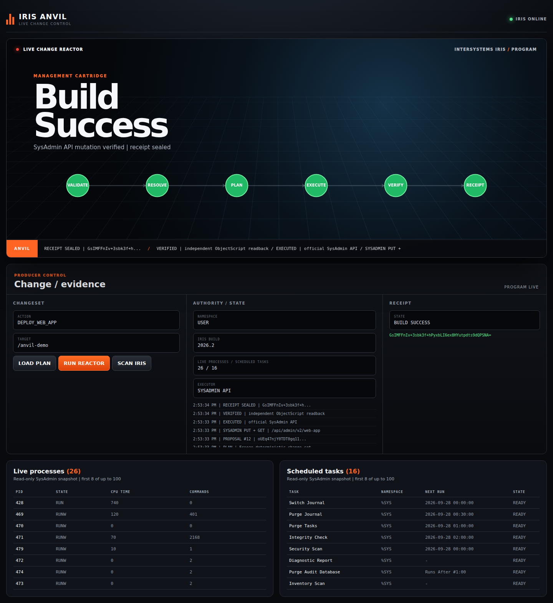

# IRIS Anvil live demo

[Watch the silent live screen recording](iris-anvil-demo.webm)

This capture was made in a fresh browser against an isolated IRIS Community
2026.2 (Build 221U) container. No API responses were mocked, and operator
credentials are not shown or stored in the recording.

The recording shows:

1. **SCAN IRIS** authenticates through the official SysAdmin API and displays
   live process and scheduled-task rows (up to 100 fetched, eight shown per
   table). This is read-only.
2. **RUN REACTOR** proposes the allowlisted `/anvil-demo` web-app change,
   performs the official SysAdmin PUT, and reads the web app back.
3. An independent ObjectScript readback verifies the declared state and seals
   the receipt. The cockpit reports **BUILD SUCCESS** only after verification.

To reproduce rather than watch, follow the [README run instructions](../README.md)
and execute `python3 scripts/smoke_iris.py` with an authorized local demo
operator. The [integration workflow](../.github/workflows/anvil-integration.yml)
runs the same server-side path on every push to `main`.
